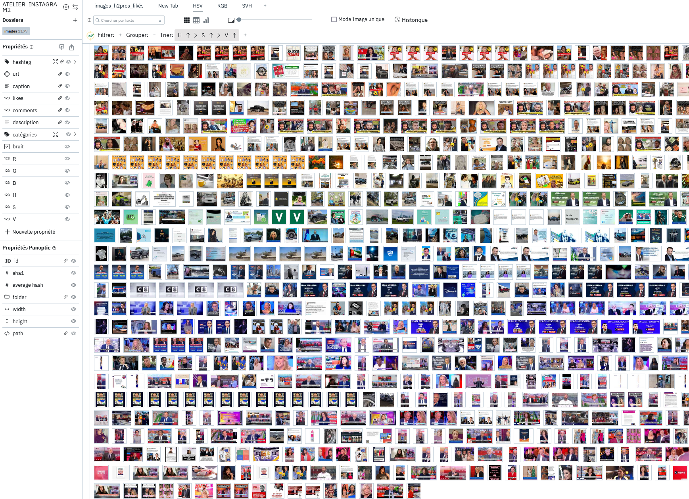

# Panoptic Colors 🌈

Really simple plugin that provides only one function to panoptic, it will compute the HSV and RGB values of all selected images and then create properties of them in order to filter, sort and group images according to this.

